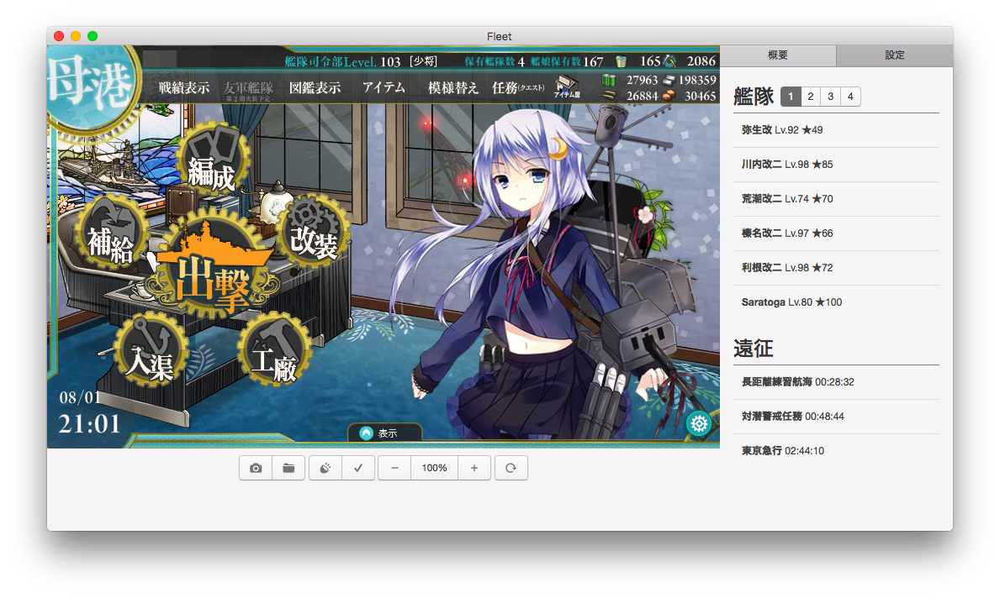

# Fleet

> A simple Kancolle browser

## Download
First, please install Adobe Flash Player (PPAPI version).
https://get.adobe.com/flashplayer/otherversions/

[Download an appropriate file](https://github.com/yuya-oc/fleet/releases)

## Features
- Multi platform. Windows, macOS and Linux are supported.
- Simplicity. You can only see condition and expedition information.
- HiDPI support. You can get fine screenshots even when using high resolution monitors.

## Notice
- **The application is provided with no warranty.**
- The application inspects your HTTP connection to take game data.
  - The application NEVER inspect your HTTPS connection.
- DON'T purchace items in the application.

## License
[The MIT License](./LICENSE)
